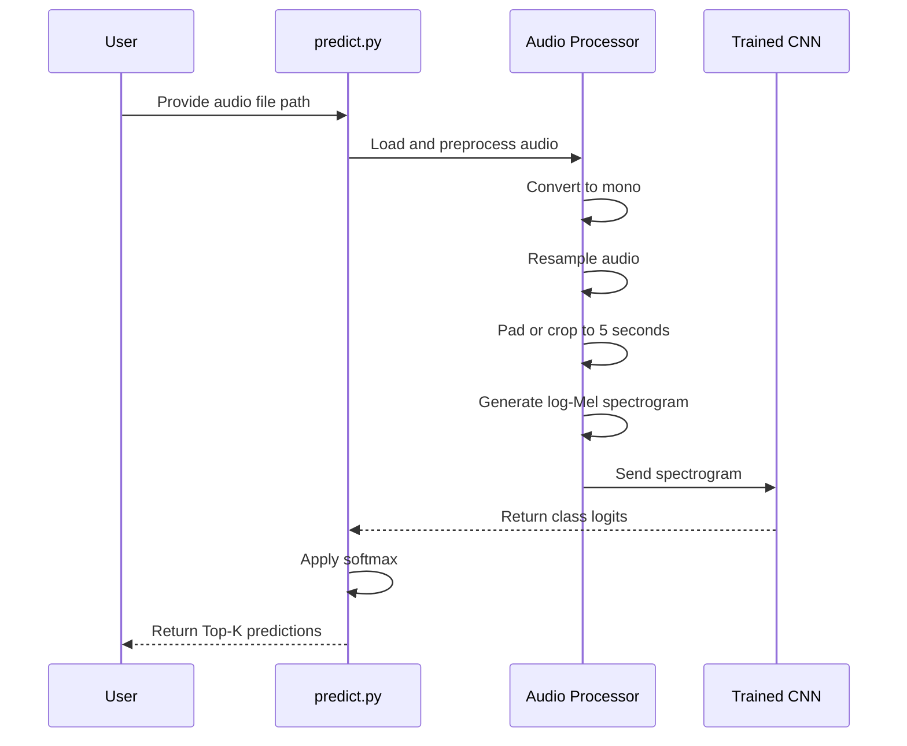

# Environmental Sound Classification

A deep learning project for classifying environmental sounds into 50 categories using the ESC-50 dataset and a convolutional neural network implemented with PyTorch.

The project converts raw audio waveforms into log-Mel spectrograms and uses a 2D CNN to classify the resulting time-frequency representations.

---

## Project Overview

Environmental Sound Classification is the task of identifying the category of a sound recording.

Examples include:

- Dog barking
- Rain
- Thunderstorm
- Human coughing
- Glass breaking
- Engine sounds
- Sirens
- Keyboard typing
- Airplane sounds

This project uses the ESC-50 dataset, which contains 2,000 environmental audio recordings divided into 50 sound classes.

---

## Features

- Audio loading with `torchaudio`
- Stereo-to-mono conversion
- Audio resampling
- Audio padding and cropping
- Log-Mel spectrogram extraction
- CNN-based audio classification
- Training and validation pipeline
- Best-model checkpointing
- Test-set evaluation
- Single-audio prediction
- Top-K class predictions
- CPU and CUDA support

---

## Dataset

This project uses the [ESC-50 Environmental Sound Classification Dataset](https://github.com/karolpiczak/ESC-50).

### Dataset Statistics

| Property | Value |
|---|---:|
| Total recordings | 2,000 |
| Number of classes | 50 |
| Recordings per class | 40 |
| Duration per recording | 5 seconds |
| Sampling rate | 44,100 Hz |
| Dataset size | Approximately 2.5 hours |

### Dataset Splits

The official ESC-50 dataset contains five folds.

This project uses:

| Split | Folds | Recordings |
|---|---|---:|
| Training | 1, 2, 3 | 1,200 |
| Validation | 4 | 400 |
| Testing | 5 | 400 |

The test fold is kept separate from training and validation.

---

## Project Pipeline

```mermaid
flowchart TD
    A[Raw Audio File] --> B[Load Audio with torchaudio]
    B --> C[Convert to Mono]
    C --> D[Resample to 44.1 kHz]
    D --> E[Pad or Crop to 5 Seconds]
    E --> F[Generate Mel Spectrogram]
    F --> G[Apply Log Transformation]
    G --> H[Audio CNN]
    H --> I[Generate Class Logits]
    I --> J[Softmax Probabilities]
    J --> K[Predicted Sound Class]
````

---

## Model Architecture

The model is a 2D convolutional neural network designed to process log-Mel spectrograms.

### Architecture

```mermaid
flowchart TD
    A[Input Log-Mel Spectrogram<br/>1 x 128 x Time] --> B[Conv2D<br/>1 to 32 Channels]
    B --> C[BatchNorm2D]
    C --> D[ReLU]
    D --> E[MaxPool2D]

    E --> F[Conv2D<br/>32 to 64 Channels]
    F --> G[BatchNorm2D]
    G --> H[ReLU]
    H --> I[MaxPool2D]

    I --> J[Conv2D<br/>64 to 128 Channels]
    J --> K[BatchNorm2D]
    K --> L[ReLU]
    L --> M[Adaptive Average Pooling<br/>1 x 1]

    M --> N[Flatten]
    N --> O[Linear Layer<br/>128 to 50]
    O --> P[50 Class Logits]
```

### Layer Summary

| Layer             | Configuration                 |
| ----------------- | ----------------------------- |
| Conv2D 1          | 1 → 32 channels, 3×3 kernel   |
| BatchNorm2D       | 32 channels                   |
| ReLU              | Activation                    |
| MaxPool2D         | 2×2                           |
| Conv2D 2          | 32 → 64 channels, 3×3 kernel  |
| BatchNorm2D       | 64 channels                   |
| ReLU              | Activation                    |
| MaxPool2D         | 2×2                           |
| Conv2D 3          | 64 → 128 channels, 3×3 kernel |
| BatchNorm2D       | 128 channels                  |
| ReLU              | Activation                    |
| AdaptiveAvgPool2D | 1×1                           |
| Flatten           | 128 features                  |
| Linear            | 128 → 50 classes              |

---

## Why Log-Mel Spectrograms?

Raw audio is a one-dimensional waveform. Although CNNs can process raw waveforms, this project first converts the waveform into a time-frequency representation.

A Mel spectrogram represents:

* **X-axis:** Time
* **Y-axis:** Mel-frequency bands
* **Values:** Energy or intensity at each frequency and time

The logarithmic transformation compresses large energy differences:

$$
S_{\text{log}} = \log(\max(S, \epsilon))
$$

where:

* \(S\) is the Mel spectrogram
* \(\epsilon\) is a small value that prevents \(\log(0)\)

This representation is useful because many environmental sounds have distinctive frequency patterns.

---

## Data Preprocessing

Each audio recording passes through the following steps:


The model expects:

```text
Sample rate: 44,100 Hz
Duration: 5 seconds
Number of samples: 220,500
Mel bands: 128
```

The input tensor shape is:

```text
[Batch Size, Channels, Mel Bands, Time Frames]
```

Example:

```text
[16, 1, 128, Time Frames]
```

---

## Training Configuration

| Parameter         |            Value |
| ----------------- | ---------------: |
| Optimizer         |             Adam |
| Loss function     | CrossEntropyLoss |
| Learning rate     |            0.001 |
| Batch size        |               16 |
| Epochs            |               50 |
| Number of classes |               50 |
| Input sample rate |        44,100 Hz |

---

## Training Results

The best validation result achieved during training:

| Metric              | Result |
| ------------------- | -----: |
| Best epoch          |     48 |
| Training accuracy   | 70.75% |
| Validation accuracy | 60.00% |
| Validation loss     | 1.3838 |

The best model is saved at:

```text
checkpoints/best_audio_cnn.pt
```

The checkpoint stores:

* Epoch number
* Model state dictionary
* Optimizer state dictionary
* Best validation accuracy

---

## Installation

Clone the repository:

```bash
git clone https://github.com/maroofiums/Environmental-Sound-Classification.git
cd Environmental-Sound-Classification
```

Create a virtual environment:

```bash
python3 -m venv .venv
```

Activate it:

```bash
source .venv/bin/activate
```

Install dependencies:

```bash
pip install -r requirements.txt
```

Depending on your PyTorch and torchaudio versions, installation commands may differ.

---

## Project Structure

```text
Environmental-Sound-Classification/
│
├── data/
│   └── ESC-50/
│       ├── audio/
│       └── meta/
│           └── esc50.csv
│
├── src/
│   ├── __init__.py
│   ├── config.py
│   ├── dataset.py
│   ├── data_loader.py
│   ├── transforms.py
│   ├── models.py
│   ├── train.py
│   ├── evaluate.py
│   └── predict.py
│
├── checkpoints/
│   └── best_audio_cnn.pt
│
├── .gitignore
├── requirements.txt
└── README.md
```

---

## Training

Run the training script from the project root:

```bash
python3 -m src.train
```

The training script:

1. Loads the dataset.
2. Creates training and validation DataLoaders.
3. Converts audio into log-Mel spectrograms.
4. Trains the CNN.
5. Evaluates the validation set.
6. Saves the best checkpoint.

---

## Evaluation

Evaluate the best saved model on the test fold:

```bash
python3 -m src.evaluate
```

The evaluation script loads:

```text
checkpoints/best_audio_cnn.pt
```

and reports:

* Test loss
* Test accuracy

---

## Single-Audio Prediction

To classify one audio file, update the path in `src/predict.py`:

```python
audio_path = Path(
    "data/ESC-50/audio/1-100032-A-0.wav"
)
```

Then run:

```bash
python3 -m src.predict
```

Example output:

```text
Using device: cpu
Loaded checkpoint from epoch 48
Best validation accuracy: 60.00%

Top Predictions
------------------------------
1. sneezing             27.73%
2. breathing            15.12%
3. glass_breaking       14.15%
4. coughing              8.01%
5. door_wood_knock       7.02%
```

The prediction output represents the model's estimated probability distribution across the sound classes.

A low top probability indicates that the model is uncertain.

---

## Inference Pipeline



---

## Limitations

The current model has several limitations:

* The CNN architecture is relatively simple.
* The dataset is small compared with many modern deep learning datasets.
* Validation accuracy fluctuates between epochs.
* There is a gap between training and validation accuracy.
* The model may be overconfident on unfamiliar sounds.
* No data augmentation is currently applied.
* No confusion matrix or per-class accuracy analysis has been added yet.
* The model has only been trained using a basic CNN architecture.

---

## Future Improvements

Potential improvements include:

* Add waveform augmentation
* Add time masking and frequency masking
* Use SpecAugment
* Add dropout
* Tune the learning rate
* Use learning-rate scheduling
* Add early stopping
* Calculate per-class accuracy
* Generate a confusion matrix
* Compare CNN architectures
* Use transfer learning with pretrained audio models
* Experiment with ResNet
* Experiment with AST or PANNs
* Add model calibration
* Build a web interface using FastAPI
* Deploy the model as an audio-classification API

---

## Technologies Used

* Python
* PyTorch
* TorchAudio
* Pandas
* tqdm
* ESC-50 Dataset

---

## License

This project is intended for educational and research purposes.

Check the ESC-50 dataset repository for its dataset license and usage conditions.
